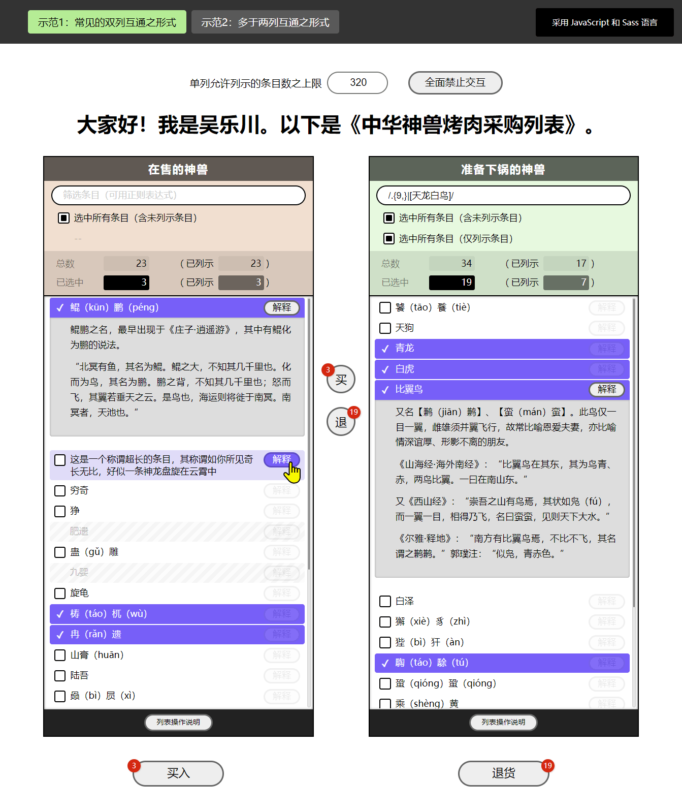
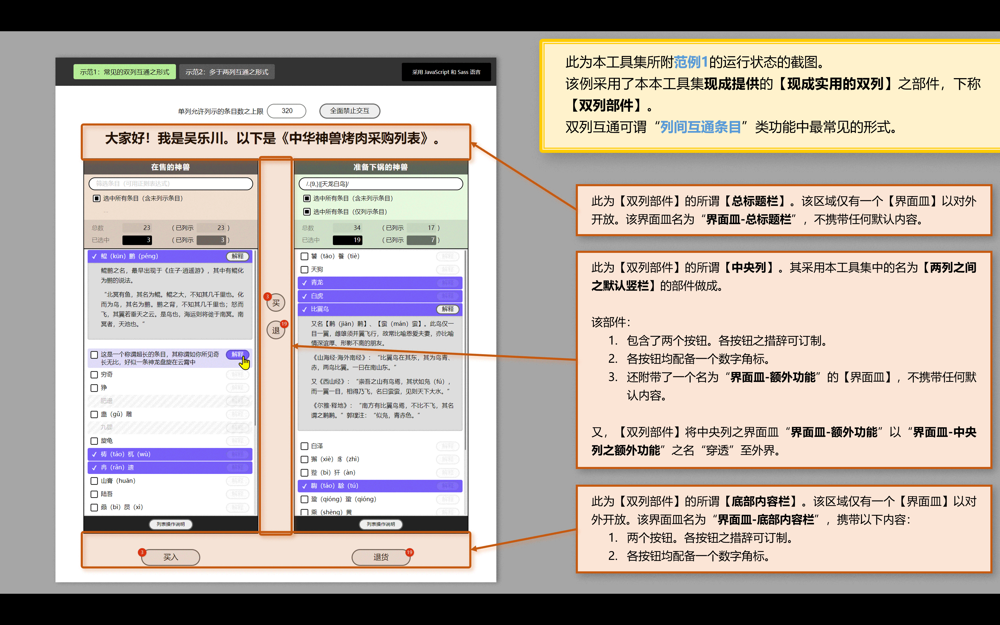
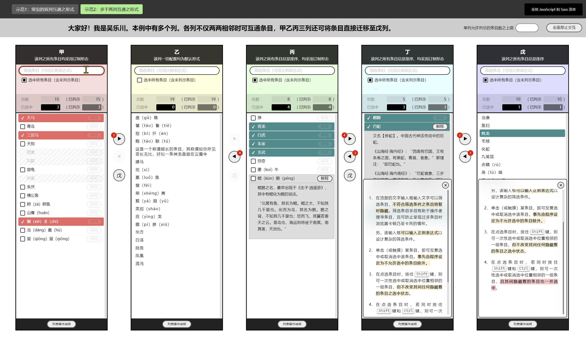
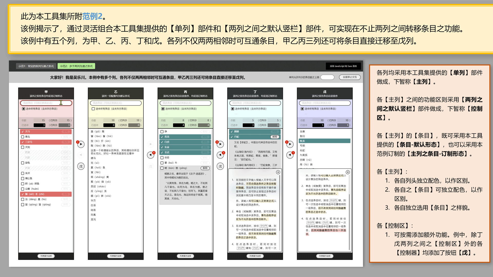

# 任意两列间转移条目<br><small>——采用 Vuejs 2.x 技术编写的界面部件</small>

<link rel="stylesheet" href="./node_modules/@wulechuan/css-stylus-markdown-themes/源代码/发布的源代码/文章排版与配色方案集/层叠样式表/wulechuan-styles-for-html-via-markdown--vscode.default.min.css">


> 中国人——特别是汉族人，理应坚持广泛、规范地使用汉语。凡非必要之情形不说外国话、不用外国字。此乃天经地义！然则每当必要，亦不排斥采用外国之语言。不妨 **博世界之学问，养中国之精神** 。
>
> 本人亦支持少数民族坚持采用自己民族的传统语言。仍须强调，凡中国人，皆应会用汉语、积极使用汉语，此乃中华各民族之大一统之必由。


## NPM 页

<dl>
<dt>NPM 包名</dt>
<dd>

[@wulechuan/vue2-ui--transfer-items-among-columns](https://www.npmjs.com/package/@wulechuan/vue2-ui--transfer-items-among-columns)

</dd>
<dt>作者</dt>
<dd><p>南昌吴乐川</p></dd>
</dl>


## 源代码仓库

| <span style="display:inline-block;width:180px;">提供仓库服务之组织</span> | <span style="display:inline-block;width:150px;">仓库组织之国别</span> | 仓库地址 |
| ------------- | :----------: | ------- |
| 码云           | 中华人民共和国 | [https://gitee.com/nanchang-wulechuan/wulechuan-typescript-vue2-ui--transfer-items-among-columns.git](https://gitee.com/nanchang-wulechuan/wulechuan-typescript-vue2-ui--transfer-items-among-columns.git) |
| 阿里云之代码仓库 | 中华人民共和国 | [https://code.aliyun.com/wulechuan/wulechuan-typescript-vue2-ui--transfer-items-among-columns.git](https://code.aliyun.com/wulechuan/wulechuan-typescript-vue2-ui--transfer-items-among-columns.git) |
| GitHub         | 美           | [https://github.com/wulechuan/wulechuan-typescript-vue2-ui--transfer-items-among-columns.git](https://github.com/wulechuan/wulechuan-typescript-vue2-ui--transfer-items-among-columns.git) |


-----


## 简介

### 功用

粗略地说，本工具集旨在提供一个类似“饿了吗”之【[`穿梭框`](https://element.eleme.cn/#/zh-CN/component/transfer)】（外国话所谓“Transfer”）的【界面部件】（外国话所谓“UX Component”）。本工具之典型形态如下图所示。



但本工具提供的界面部件不止一个，而是一组。这些部件全部采用 Vuejs 2.x 技术做成。这些部件或为包含关系，或为平级关系，配合联动，更为灵活。上图中的典型形态即是采用若干部件拼搭而得的。

本工具集中的界面部件具体有：

1.  【`单列`】部件。其组成如下：

    -   其 **主体** 为一个竖列，其内罗列若干条目。这些条目可以“选中”。凡选中者，可经其他部件或其他功能代码“转移”至另一【`单列`】中去。
    -   主体上方附带了**条目筛选功能区**。
    -   主体上方附带了**统计摘要之功能区**。
    -   主体下方附带了**说明书开关功能区**。该功能区内含一枚按钮和一个 **说明书面板** 。其中的说明书面板由【`单列之说明书`】部件做成。其中的按钮可开关说明书面板。

1.  【`单列之说明书`】部件。【`单列`】部件已采用本部件。

    > 一般情形下程序员*不必*采用本部件（即指【`单列之说明书`】部件）。
    >
    > 然而，当界面设计师要求单列之说明书在其应用之其他位置呈现时，程序员可以采用本部件另行构建说明书。

1.  【`条目-默认形态`】部件。此为【`单列`】部件中列示的条目之默认形态。

    > 另，条目之形态亦可订制。订制形态须脱离于默认形态单独制作，而非在默认形态之基础上修改变化。见下文。

1.  【`两列之间之默认竖栏`】部件。本部件适合置于两个【`单列`】部件之间，用于操控两个单列中的各条目，令条目在列间转移。

1.  【`现成实用的双列`】部件。本部件采用【`单列`】部件和【`两列之间之默认竖栏`】部件组合做成。多数情形下，设计师之要求实现条目仅在两列之间资源转移，故本部件直接适用。

参阅下图若干。







----


## 术语

### 术语概述

本文有少数概念较为关键。为减少乃至消除歧义，先为各概念约定术语。部分术语为本人之拙见，未必见于其他文章或材料。

### 术语表

1. #### 【`部件`】

    外国话所谓 component 。其它文章或材料多译为【组件】。但本工具集及相关文档坚持称【部件】。

1. #### 【`条目在乙列`】与【`条目被选中`】

    于典型的“条目在两列之间自由转移”之功能，每当有条目从`左列`（或称`甲列`）转移到`右列`（或称`乙列`）时，通常我们可能采用“_选中_”、“_挑拣_”、“_挑选_”、“_选择_”等词来描述这一转移动作，及其结果。但考虑到在甲乙两列之任意一列中的条目，在参与转移之前，须先被标记为“_处于等待转移之状态_”。这一标记动作及其结果也可用“_选中_”、“_挑拣_”、“_挑选_”、“_选择_”等字眼来表达。于是，歧义出现。

    为消除上述歧义，本文约定：

    -   当表达条目被标记为“**稍后可转移至另一列**”之状态时，我们说【`条目被选中`】；
    -   当表达条目已转移到乙列时，我们说【`条目在乙列`】。

1. #### 【`界面皿`】

    Vuejs 的模板系统中有一种名为 `slot` 的元素，用以容纳外界提供的界面片段。官方的汉语文档中称之为【`插槽`】。但我在本文中坚持称其为【`界面皿`】。


-----

## 用法

### 安装

```sh
npm  i  @wulechuan/vue2-ui--transfer-items-among-columns
```


### 具体示例

#### 使用【`现成实用的双列`】部件

-   类 HTML 模板的写法示范

    ```html
    <div class="页面 页面--示范页3-遣将">
        <Wlc任意两列间转移条目_现成实用的双列
            v-model="已出征的将军之列表"
            :双列全部条目之总列表="所有中华名将之列表"

            甲列之称谓="未出征的中华名帅名将"
            乙列之称谓="已出征的中华名帅名将"
            界面措辞_中央竖栏_内建按钮甲="出征"
            界面措辞_中央竖栏_内建按钮乙="凯旋"
            界面措辞_底部内容栏默认内容_按钮甲="出征"
            界面措辞_底部内容栏默认内容_按钮乙="凯旋"

            :各列均无需底部的说明书功能区="false"
            :应全面禁止交互="false"
            :无需底部内容栏="false"
            :无需中央列之功能="true"
        >
            <template v-slot:界面皿-总标题栏>
                <h3>遣将</h3>
            </template>
        </Wlc任意两列间转移条目_现成实用的双列>
    </div>
    ```

-   功能逻辑的写法示范（采用 TypeScript 语言）

    ```typescript
    import { Vue, Component } from 'vue-property-decorator'

    import {
        Wlc任意两列间转移条目_现成实用的双列,
    } from '@wulechuan/vue2-ui--transfer-items-among-columns'

    import type {
        范_条目之唯一标识之列表,
        范_基础条目,
    } from '@wulechuan/vue2-ui--transfer-items-among-columns'

    /**
    * 本专用的“范”。
    * 注：所谓“范”，即通常所说的“类型”。
    */
    type 范_中华名将_实际条目 = 范_基础条目 & {
        数据: {
            诞年: string;
            排序数: number;
            朝代或时期: string;
        };
    };

    const 所有中华名将之列表: Array<范_中华名将_实际条目> = [
        { 姓名: '妇好', 朝代或时期: '商', 诞年排序数: -1200 },
        { 姓名: '霍去病', 朝代或时期: '西汉', 诞年: -140 },
        { 姓名: '赵云', 朝代或时期: '东汉（三国）', 诞年排序数: 190 },
        { 姓名: '秦琼', 朝代或时期: '隋末唐初', 诞年排序数: 600 },
        { 姓名: '王忠嗣', 朝代或时期: '唐', 诞年: 705 },
        { 姓名: '杨业', 朝代或时期: '北宋', 诞年排序数: 930 },
        { 姓名: '岳飞', 朝代或时期: '南宋', 诞年: 1103 },
        { 姓名: '辛弃疾', 朝代或时期: '南宋', 诞年: 1140 },
        { 姓名: '袁崇焕', 朝代或时期: '明末', 诞年: 1584 },
        { 姓名: '郑成功', 朝代或时期: '明末清初', 诞年: 1624 },
        { 姓名: '戚继光', 朝代或时期: '明', 诞年: 1528 },
        { 姓名: '左宗棠', 朝代或时期: '清末', 诞年: 1812 },
        { 姓名: '张自忠', 朝代或时期: '当代', 诞年: 1891 },
        { 姓名: '刘伯承', 朝代或时期: '当代', 诞年: 1892 },
        { 姓名: '彭德怀', 朝代或时期: '当代', 诞年: 1898 },
    ].map(某位将军的基本配置 => {
        const {
            姓名,
            诞年,
            诞年排序数,
            朝代或时期,
        } = 某位将军的基本配置

        let 排序数: number
        let 诞年_采纳值: string

        if (typeof 诞年排序数 === 'number') {
            排序数 = 诞年排序数
        } else if (typeof 诞年 === 'number') {
            排序数 = 诞年
        } else {
            console.error('某位将军之配置未指明排序数。', { ...某位将军的基本配置 })
            排序数 = 2022
        }

        if (typeof 诞年 === 'number') {
            诞年_采纳值 = `${诞年}`
        } else {
            诞年_采纳值 = '?'
        }

        const 唯一标识 = 姓名

        const 在界面中的称谓 = `〔${朝代或时期}〕${姓名}。${
            诞年_采纳值 === '?' ? `诞年不详，约 ${排序数} 年。` : `诞于 ${诞年_采纳值} 年。`
        }`

        const 某名将之条目: 范_中华名将_实际条目 = {
            唯一标识,
            在界面中的称谓,
            已禁止选择: false,

            数据: {
                排序数,
                诞年: 诞年_采纳值,
                朝代或时期,
            },
        }

        return 某名将之条目
    }).sort((甲, 乙) => 甲.数据.排序数 - 乙.数据.排序数)


    @Component({
        components: {
            Wlc任意两列间转移条目_现成实用的双列,
        },
    })
    export default class Page示范页3_遣将 extends Vue {
        private 已出征的将军之列表: 范_条目之唯一标识之列表 = [ '郑成功', '岳飞' ]
        private 所有中华名将之列表: Array<范_中华名将_实际条目> = 所有中华名将之列表
    }
    ```

-   功能逻辑的写法示范（采用 JavaScript 语言）

    ```js

    ```

-   补充样式（采用 Stylus 语言）

    1.  应在你的 Vue 项目的 `main.ts` 中一次性加载的标志样式。

        ```stylus

        ```

    2.  为本示范页专属的补充样式。

        ```stylus
        .页面--示范页3-遣将 {
            height 100%
            display flex
            flex-direction column
            justify-content center
            align-items center

            h3 {
                font-size 2rem
                text-align center
                margin 0
                padding 1rem
            }
        }
        ```

#### 将【`单列`】与【`两列之间之默认竖栏`】部件灵活组合

-   类 HTML 模板的写法示范

    ```html

    ```

-   功能逻辑的写法示范（采用 TypeScript 语言）

    ```typescript

    ```

-   功能逻辑的写法示范（采用 JavaScript 语言）

    ```js

    ```


### 应用编程接口（所谓 API）


TypeScript

```typescript

```

