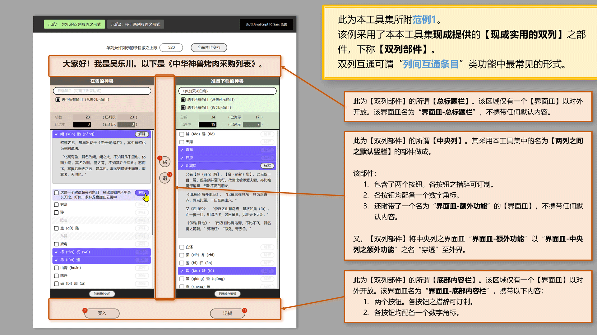

# 任意两列间转移条目<br><small>——采用 Vuejs 2.x 技术编写的界面部件</small>

<link rel="stylesheet" href="./node_modules/@wulechuan/css-stylus-markdown-themes/源代码/发布的源代码/文章排版与配色方案集/层叠样式表/wulechuan-styles-for-html-via-markdown--vscode.default.min.css">


> 中国人——特别是汉族人，理应坚持广泛、规范地使用汉语。凡非必要之情形不说外国话、不用外国字。此乃天经地义！然则每当必要，亦不排斥采用外国之语言。不妨 **博世界之学问，养中国之精神** 。
>
> 本人亦支持少数民族坚持采用自己民族的传统语言。仍须强调，凡中国人，皆应会用汉语、积极使用汉语，此乃中华各民族之大一统之必由。


## NPM 页

<dl>
<dt>NPM 包名</dt>
<dd>

[@wulechuan/vue2-ui--transfer-items-among-columns](https://www.npmjs.com/package/@wulechuan/vue2-ui--transfer-items-among-columns)

</dd>
<dt>作者</dt>
<dd><p>南昌吴乐川</p></dd>
</dl>


## 简介

### 功用

粗略地说，本工具集旨在提供一个类似“饿了吗”之【[`穿梭框`](https://element.eleme.cn/#/zh-CN/component/transfer)】（外国话所谓“Transfer”）的【界面部件】（外国话所谓“UX Component”）。本工具之典型形态如下图所示。


但本工具提供的界面部件不止一个，而是一组。这些部件全部采用 Vuejs 2.x 技术做成。这些部件或为包含关系，或为平级关系，配合联动，更为灵活。上图中的典型形态即是采用若干部件拼搭而得的。

本工具集中的界面部件具体有：

1.  【`单列`】部件。其组成如下：

    -   其 **主体** 为一个竖列，其内罗列若干条目。这些条目可以“选中”。凡选中者，可经其他部件或其他功能代码“转移”至另一【`单列`】中去。
    -   主体上方附带了 **条目筛选功能区** 。
    -   主体上方附带了 **统计摘要之功能区** 。
    -   主体下方附带了 **说明书开关功能区** 。该功能区内含一枚按钮和一个 **说明书面板** 。其中的说明书面板由【`单列之说明书`】部件做成。其中的按钮可开关说明书面板。

1.  【`单列之说明书`】部件。【`单列`】部件已采用本部件。

    > 一般情形下程序员*不必*采用本部件（即指【`单列之说明书`】部件）。
    >
    > 然而，当界面设计师要求单列之说明书在其应用之其他位置呈现时，程序员可以采用本部件另行构建说明书。

1.  【`条目-默认形态`】部件。此为【`单列`】部件中列示的条目之默认形态。

    > 另，条目之形态亦可订制。订制形态须脱离于默认形态单独制作，而非在默认形态之基础上修改变化。见下文。

1.  【`两列之间之默认竖栏`】部件。本部件适合置于两个【`单列`】部件之间，用于操控两个单列中的各条目，令条目在列间转移。

1.  【`现成实用的双列`】部件。本部件采用【`单列`】部件和【`两列之间之默认竖栏`】部件组合做成。多数情形下，设计师之要求实现条目在两列之间资源转移，故本部件直接适用。

参阅下图若干。




----


## 术语

### 术语概述

本文有少数概念较为关键。为减少乃至消除歧义，先为各概念约定术语。部分术语为本人之拙见，未必见于其他文章或材料。

### 术语表

1. #### 【`条目在乙列`】与【`条目被选中`】

    于典型的“条目在两列之间自由转移”之功能，每当有条目从`左列`（或称`甲列`）转移到`右列`（或称`乙列`）时，通常我们可能采用“_选中_”、“_挑拣_”、“_挑选_”、“_选择_”等词来描述这一转移动作，及其结果。但考虑到在甲乙两列之任意一列中的条目，在参与转移之前，须先被标记为“_处于等待转移之状态_”。这一标记动作及其结果也可用“_选中_”、“_挑拣_”、“_挑选_”、“_选择_”等字眼来表达。于是，歧义出现。

    为消除上述歧义，本文约定：

    -   当表达条目被标记为“**稍后可转移至另一列**”之状态时，我们说【`条目被选中`】；
    -   当表达条目已转移到乙列时，我们说【`条目在乙列`】。

1. #### 【`界面皿`】

    Vuejs 的模板系统中有一种名为 `slot` 的元素，用于容纳外界提供的界面片段。官方的汉语文档中称之为【`插槽`】。但我在本文中坚持称其为【`界面皿`】。


----

## 用法

### 安装

```sh
npm  i  @wulechuan/vue2-ui--transfer-items-among-columns
```


### 具体示例

```js

```


### 应用编程接口（所谓 API）


```ts

```

----


## 源代码仓库

| <span style="display:inline-block;width:180px;">提供仓库服务之组织</span> | <span style="display:inline-block;width:150px;">仓库组织之国别</span> | 仓库地址 |
| ------------- | :----------: | ------- |
| 码云           | 中华人民共和国 | [https://gitee.com/nanchang-wulechuan/wulechuan-typescript-vue2-ui--transfer-items-among-columns.git](https://gitee.com/nanchang-wulechuan/wulechuan-typescript-vue2-ui--transfer-items-among-columns.git) |
| 阿里云之代码仓库 | 中华人民共和国 | [https://code.aliyun.com/wulechuan/wulechuan-typescript-vue2-ui--transfer-items-among-columns.git](https://code.aliyun.com/wulechuan/wulechuan-typescript-vue2-ui--transfer-items-among-columns.git) |
| GitHub         | 美           | [https://github.com/wulechuan/wulechuan-typescript-vue2-ui--transfer-items-among-columns.git](https://github.com/wulechuan/wulechuan-typescript-vue2-ui--transfer-items-among-columns.git) |


---

## 未来计划

- 暂无。


