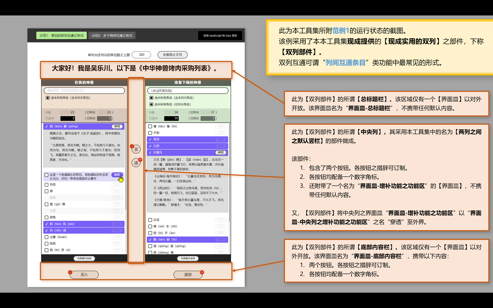
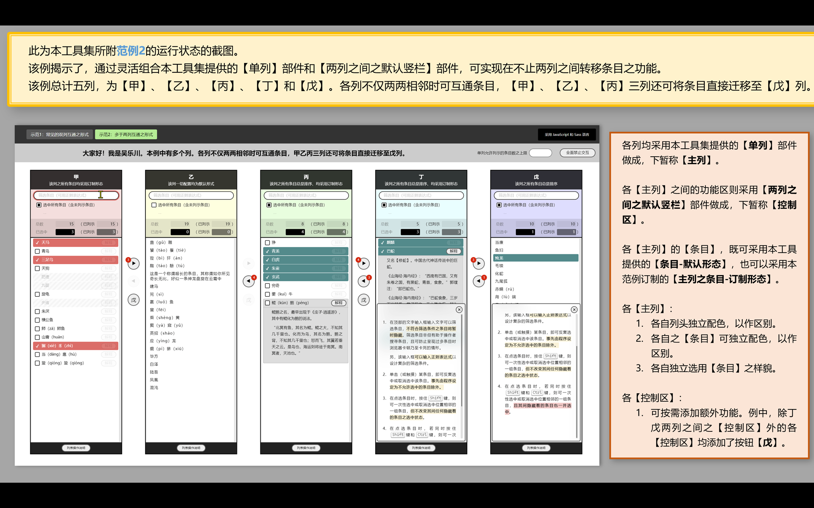

# 任意两列间转移条目<br><small>——采用 Vuejs 2.x 技术编写的界面部件</small>

<link rel="stylesheet" href="./node_modules/@wulechuan/css-stylus-markdown-themes/源代码/发布的源代码/文章排版与配色方案集/层叠样式表/wulechuan-styles-for-html-via-markdown--vscode.default.min.css">


> 中国人——特别是汉族人，理应坚持广泛、规范地使用汉语。凡非必要之情形不说外国话、不用外国字。此乃天经地义！然则每当必要，亦不排斥采用外国之语言。不妨 **博世界之学问，养中国之精神** 。
>
> 本人亦支持少数民族坚持采用自己民族的传统语言。仍须强调，凡中国人，皆应会用汉语、积极使用汉语，此乃中华各民族之大一统之必由。


## NPM 页

<dl>
<dt>NPM 包名</dt>
<dd>

[@wulechuan/vue2-ui--transfer-items-among-columns](https://www.npmjs.com/package/@wulechuan/vue2-ui--transfer-items-among-columns)

</dd>
<dt>作者</dt>
<dd><p>南昌吴乐川</p></dd>
</dl>


## 源代码仓库

| <span style="display:inline-block;width:180px;">提供仓库服务之组织</span> | <span style="display:inline-block;width:150px;">仓库组织之国别</span> | 仓库地址 |
| ------------- | :----------: | ------- |
| 码云           | 中华人民共和国 | [https://gitee.com/nanchang-wulechuan/wulechuan-typescript-vue2-ui--transfer-items-among-columns.git](https://gitee.com/nanchang-wulechuan/wulechuan-typescript-vue2-ui--transfer-items-among-columns.git) |
| 阿里云之代码仓库 | 中华人民共和国 | [https://code.aliyun.com/wulechuan/wulechuan-typescript-vue2-ui--transfer-items-among-columns.git](https://code.aliyun.com/wulechuan/wulechuan-typescript-vue2-ui--transfer-items-among-columns.git) |
| GitHub         | 美           | [https://github.com/wulechuan/wulechuan-typescript-vue2-ui--transfer-items-among-columns.git](https://github.com/wulechuan/wulechuan-typescript-vue2-ui--transfer-items-among-columns.git) |


-----


## 简介

### 功用

粗略地说，本工具集旨在提供一个【界面部件】（外国话所谓“UX Component”），其外观、功用均类似于“饿了吗”之【[`穿梭框`](https://element.eleme.cn/#/zh-CN/component/transfer)】（外国话所谓“Transfer”）。本工具之典型形态如下图所示。


但本工具提供的界面部件不止一个，而是一组。这些部件全部采用 Vuejs 2.x 技术做成。这些部件或为包含关系，或为平级关系，配合联动，更为灵活。上图中的典型形态即是采用若干部件拼搭而得的。

本工具集中的界面部件具体有：

1.  【`单列`】部件。其组成如下：

    -   其 **主体** 为一个竖列，其内罗列若干【条目】。这些【条目】可以“选中”。凡选中者，可经其他部件或其他功能代码“转移”至另一【`单列`】中去。一般的，“选中”的【条目】在视觉上会较其余【条目】“凸显”。
    -   主体上方附带了 **【条目】筛选功能区** 。
    -   主体上方附带了**统计摘要之功能区**。
    -   主体下方附带了**说明书开关功能区**。该功能区内含一枚按钮和一个 **说明书面板** 。其中的说明书面板由【`单列之说明书`】部件做成。其中的按钮可开关说明书面板。

1.  【`单列之说明书`】部件。【`单列`】部件已采用本部件。

    > 一般情形下程序员*不必*采用本部件（即指【`单列之说明书`】部件）。
    >
    > 然而，当界面设计师要求单列之说明书在其应用之其他位置呈现时，程序员可以采用本部件另行构建说明书。

1.  【`条目-默认形态`】部件。此为【`单列`】部件中列示的条目之默认形态。

    > 既然它是默认形态，程序员*不必*采用本部件（即指【`条目-默认形态`】部件）。
    >
    > 另，【条目】之形态亦可订制。订制形态须脱离于默认形态单独制作，而非在默认形态之基础上修改变化。

1.  【`两列之间之默认竖栏`】部件。本部件适合置于两个【`单列`】部件之间，用于操控两个单列中的各【条目】，令【条目】在列间转移。

1.  【`现成实用的双列`】部件。本部件采用【`单列`】部件和【`两列之间之默认竖栏`】部件组合做成。我们知道，**多数情形下，设计师只要求实现条目仅在两列之间资源转移，故本部件直接适用。**

参阅下图若干。






----


## 术语

### 术语概述

本文有少数概念较为关键。为减少乃至消除歧义，先为各概念约定术语。部分术语为本人之拙见，未必见于其他文章或材料。

### 术语表

1. #### 【`部件`】

    外国话所谓 component 。其它文章或材料多译为【组件】。但本工具集及相关文档坚持称【部件】。

1. #### 【`条目在乙列`】与【`条目被选中故而凸显`】

    于典型的“条目在两列之间自由转移”之功能，每当有条目从`左列`（或称`甲列`）转移到`右列`（或称`乙列`）时，通常我们可能采用“_选中_”、“_挑拣_”、“_挑选_”、“_选择_”等词来描述这一转移动作，及其结果。但考虑到在甲乙两列之任意一列中的条目，在参与转移之前，须先被标记为“_处于等待转移之状态_”。这一标记动作及其结果也可用“_选中_”、“_挑拣_”、“_挑选_”、“_选择_”等字眼来表达。于是，歧义出现。

    为消除上述歧义，本文约定：

    -   当表达条目被标记为“**稍后可转移至另一列**”之状态时，我们说【`条目被选中故而凸显`】；
    -   当表达条目已转移到乙列时，我们说【`条目在乙列`】。

1. #### 【`界面皿`】

    Vuejs 的模板系统中有一种名为 `slot` 的元素，用以容纳外界提供的界面片段。官方的汉语文档中称之为【`插槽`】。但我在本文中坚持称其为【`界面皿`】。

1. #### 【范】

    所谓【范】，对应 TypeScript 或 JSDocs 概念中的 type 。一般译为【类型】，但本工具集及相关文档坚持称【范】。例如：

    - TypeScript

        ```typescript
        interface 范_基础条目 {
            唯一标识: 范_条目之唯一标识;
            在界面中的称谓: string;
            已禁止选择?: boolean;
            数据?: any;
        }
        ```

    - JSDocs

        ```js
        /**
         * @typedef {object} 范_基础条目
         * @property {范_条目之唯一标识} 唯一标识
         * @property {string} 在界面中的称谓
         * @property {?boolean} 已禁止选择
         * @property {?any} 数据
         */
        ```


-----

## 用法

### 安装

```sh
npm  i  @wulechuan/vue2-ui--transfer-items-among-columns
```


### 用法概述

#### 各【部件】之关系

-  【`现成实用的双列`】包含并使用：

    -  【`单列`】。【单列】包含并单列使用：

        -  【`单列之说明书`】。

        -  【`主表条目_默认形态`】。

    -  【`两列之间之竖栏_默认形态`】。


#### 关键数据之【范】

##### 【条目】数据之范

【`现成实用的双列`】和【`单列`】都会用到这样一种数据：【条目】之列表。其中【`现成实用的双列`】简介采用这类数据。因此，准确地说，仅【`单列`】这一部件采用【条目】数据。

在现实应用环境中，【条目】的外观、功能因各应用之功能要求而异，变化多端。因此，外界代码向【`单列`】部件提供【条目】列表时，附带的数据自然也各不相同。

为保通用、普适，本工具集仅对【条目】数据之结构仅做最简要求。该最简要求以一个 TypeScript 【范】体现，以 `interface` 做成。该【范】名为【`范_基础条目`】。如下：

```typescript
interface 范_基础条目 {
    唯一标识: 范_条目之唯一标识;
    在界面中的称谓: string;
    已禁止选择?: boolean;
    数据?: any;
}
```

须知，较为实用的情形，往往要求外界给出的【实用条目】之范系从上述【范_基础条目】扩展而得，特别是要对【`数据`】一项按需做详实定义。以下是若干假象的例子：

1.  例1，中华神兽。本例中的【实用条目】之【范】故意采用 `interface` 做成。并借助了 `extends` 保留字。

    ```typescript
    import type 范_基础条目 from '@wulechuan/vue2-ui--transfer-items-among-columns'

    export interface 范_任意两列间转移条目_实际条目_中华神兽 extends 范_基础条目 {
        数据?: {
            描述?: string | string[];
            描述内容块已展开故而描述呈现?: boolean;
        };
    }
    ```

1.  例1，中华名将。本例中的【实用条目】之【范】故意采用 `type` 做成。并借助了 `&` 运算符。

    ```typescript
    import type 范_基础条目 from '@wulechuan/vue2-ui--transfer-items-among-columns'

    export type 范_中华名将_实际条目 = 范_基础条目 & {
        数据: {
            诞年: string;
            排序数: number;
            朝代或时期: string;
        };
    };
    ```

另须知，【条目】之数据**并非**【条目】之界面部件，尽管二者紧密配合。参阅本文的《[订制【`条目`】部件](#订制条目部件)》。

### 各【部件】之具体应用示例

#### 使用【`现成实用的双列`】部件

##### 运行状态的截图


1. #####  类 HTML 模板的写法示范

    ```html
    <div class="页面 页面--示范页3-遣将">
        <Wlc任意两列间转移条目_现成实用的双列
            v-model="已出征的将军之列表"
            :双列全部条目之总列表="可任命的中华名将之列表"

            甲列之称谓="未出征的中华名帅名将"
            乙列之称谓="已出征的中华名帅名将"

            界面措辞_中央竖栏_内建按钮甲="出征"
            界面措辞_中央竖栏_内建按钮乙="凯旋"
            界面措辞_底部内容栏默认内容_按钮甲="出征"
            界面措辞_底部内容栏默认内容_按钮乙="凯旋"

            :应全面禁止交互="false"

            :无需底部内容栏="false"
            :无需中央列之功能="true"
            :各列均无需底部的说明书功能区="false"
        >
            <template v-slot:界面皿-总标题栏>
                <h3>遣将</h3>
            </template>
        </Wlc任意两列间转移条目_现成实用的双列>
    </div>
    ```

1.  ##### 功能逻辑的写法示范

    -   采用 TypeScript 语言

        ```typescript
        import { Vue, Component } from 'vue-property-decorator'

        import {
            Wlc任意两列间转移条目_现成实用的双列,
        } from '@wulechuan/vue2-ui--transfer-items-among-columns'

        import type {
            范_条目之唯一标识之列表,
            范_基础条目,
        } from '@wulechuan/vue2-ui--transfer-items-among-columns'

        /**
        * 本页面专用的各种“范”。
        * 注：所谓“范”，即通常所说的“类型”。
        */
        type 范_中华名将_实际条目 = 范_基础条目 & {
            数据: {
                诞年: string;
                排序数: number;
                朝代或时期: string;
            };
        };

        const 可任命的中华名将之列表: Array<范_中华名将_实际条目> = [
            { 姓名: '妇好', 朝代或时期: '商', 诞年排序数: -1200 },
            { 姓名: '霍去病', 朝代或时期: '西汉', 诞年: -140 },
            { 姓名: '赵云', 朝代或时期: '东汉（三国）', 诞年排序数: 190 },
            { 姓名: '秦琼', 朝代或时期: '隋末唐初', 诞年排序数: 600 },
            { 姓名: '王忠嗣', 朝代或时期: '唐', 诞年: 705 },
            { 姓名: '杨业', 朝代或时期: '北宋', 诞年排序数: 930 },
            { 姓名: '岳飞', 朝代或时期: '南宋', 诞年: 1103 },
            { 姓名: '辛弃疾', 朝代或时期: '南宋', 诞年: 1140 },
            { 姓名: '袁崇焕', 朝代或时期: '明末', 诞年: 1584 },
            { 姓名: '郑成功', 朝代或时期: '明末清初', 诞年: 1624 },
            { 姓名: '戚继光', 朝代或时期: '明', 诞年: 1528 },
            { 姓名: '左宗棠', 朝代或时期: '清末', 诞年: 1812 },
            { 姓名: '张自忠', 朝代或时期: '当代', 诞年: 1891 },
            { 姓名: '刘伯承', 朝代或时期: '当代', 诞年: 1892 },
            { 姓名: '彭德怀', 朝代或时期: '当代', 诞年: 1898 },
        ].map(某位将军的基本配置 => {
            const {
                姓名,
                诞年,
                诞年排序数,
                朝代或时期,
            } = 某位将军的基本配置

            let 排序数: number
            let 诞年_采纳值: string

            if (typeof 诞年排序数 === 'number') {
                排序数 = 诞年排序数
            } else if (typeof 诞年 === 'number') {
                排序数 = 诞年
            } else {
                console.error('某位将军之配置未指明排序数。', { ...某位将军的基本配置 })
                排序数 = 2022
            }

            if (typeof 诞年 === 'number') {
                诞年_采纳值 = `${诞年}`
            } else {
                诞年_采纳值 = '?'
            }

            const 唯一标识 = 姓名

            const 在界面中的称谓 = `〔${朝代或时期}〕${姓名}。${
                诞年_采纳值 === '?' ? `诞年不详，约 ${排序数} 年。` : `诞于 ${诞年_采纳值} 年。`
            }`

            const 某名将之条目: 范_中华名将_实际条目 = {
                唯一标识,
                在界面中的称谓,
                已禁止选择: false,

                数据: {
                    排序数,
                    诞年: 诞年_采纳值,
                    朝代或时期,
                },
            }

            return 某名将之条目
        }).sort((甲, 乙) => 甲.数据.排序数 - 乙.数据.排序数)


        @Component({
            components: {
                Wlc任意两列间转移条目_现成实用的双列,
            },
        })
        export default class Page示范页3_遣将 extends Vue {
            private 已出征的将军之列表: 范_条目之唯一标识之列表 = [ '郑成功', '岳飞' ]
            private 可任命的中华名将之列表: Array<范_中华名将_实际条目> = 可任命的中华名将之列表
        }
        ```

    -   采用 JavaScript 语言

        ```js
        import {
            Wlc任意两列间转移条目_现成实用的双列,
        } from '@wulechuan/vue2-ui--transfer-items-among-columns'

        /** @typedef {import('@wulechuan/vue2-ui--transfer-items-among-columns').范_条目之唯一标识之列表} 范_条目之唯一标识之列表 */
        /** @typedef {import('@wulechuan/vue2-ui--transfer-items-among-columns').范_基础条目} 范_基础条目 */

        /**
        * 本页面专用的各种“范”。
        * 注：所谓“范”，即通常所说的“类型”。
        */

        /**
        * @typedef {object} 范_中华名将_实际条目
        * @property {范_基础条目['唯一标识']} 唯一标识
        * @property {范_基础条目['在界面中的称谓']} 在界面中的称谓
        * @property {范_基础条目['已禁止选择']} 已禁止选择
        * @property {object} 数据
        * @property {string} 数据.诞年
        * @property {number} 数据.排序数
        * @property {string} 数据.朝代或时期
        */

        /** @type {Array<范_中华名将_实际条目>} */
        const 可任命的中华名将之列表 = [
            { 姓名: '妇好', 朝代或时期: '商', 诞年排序数: -1200 },
            { 姓名: '霍去病', 朝代或时期: '西汉', 诞年: -140 },
            { 姓名: '赵云', 朝代或时期: '东汉（三国）', 诞年排序数: 190 },
            { 姓名: '秦琼', 朝代或时期: '隋末唐初', 诞年排序数: 600 },
            { 姓名: '王忠嗣', 朝代或时期: '唐', 诞年: 705 },
            { 姓名: '杨业', 朝代或时期: '北宋', 诞年排序数: 930 },
            { 姓名: '岳飞', 朝代或时期: '南宋', 诞年: 1103 },
            { 姓名: '辛弃疾', 朝代或时期: '南宋', 诞年: 1140 },
            { 姓名: '袁崇焕', 朝代或时期: '明末', 诞年: 1584 },
            { 姓名: '郑成功', 朝代或时期: '明末清初', 诞年: 1624 },
            { 姓名: '戚继光', 朝代或时期: '明', 诞年: 1528 },
            { 姓名: '左宗棠', 朝代或时期: '清末', 诞年: 1812 },
            { 姓名: '张自忠', 朝代或时期: '当代', 诞年: 1891 },
            { 姓名: '刘伯承', 朝代或时期: '当代', 诞年: 1892 },
            { 姓名: '彭德怀', 朝代或时期: '当代', 诞年: 1898 },
        ].map(某位将军的基本配置 => {
            const {
                姓名,
                诞年,
                诞年排序数,
                朝代或时期,
            } = 某位将军的基本配置

            /** @type {number} */
            let 排序数

            /** @type {string} */
            let 诞年_采纳值

            if (typeof 诞年排序数 === 'number') {
                排序数 = 诞年排序数
            } else if (typeof 诞年 === 'number') {
                排序数 = 诞年
            } else {
                console.error('某位将军之配置未指明排序数。', { ...某位将军的基本配置 })
                排序数 = 2022
            }

            if (typeof 诞年 === 'number') {
                诞年_采纳值 = `${诞年}`
            } else {
                诞年_采纳值 = '?'
            }

            const 唯一标识 = 姓名

            const 在界面中的称谓 = `〔${朝代或时期}〕${姓名}。${
                诞年_采纳值 === '?' ? `诞年不详，约 ${排序数} 年。` : `诞于 ${诞年_采纳值} 年。`
            }`

            /** @type {范_中华名将_实际条目} */
            const 某名将之条目 = {
                唯一标识,
                在界面中的称谓,
                已禁止选择: false,

                数据: {
                    排序数,
                    诞年: 诞年_采纳值,
                    朝代或时期,
                },
            }

            return 某名将之条目
        }).sort((甲, 乙) => 甲.数据.排序数 - 乙.数据.排序数)


        export default {
            components: {
                Wlc任意两列间转移条目_现成实用的双列,
            },

            data () {
                return {
                    /** @type {范_条目之唯一标识之列表} */
                    已出征的将军之列表: [ '郑成功', '岳飞' ],

                    /** @type {Array<范_中华名将_实际条目>} */
                    可任命的中华名将之列表,
                }
            },

            activated () {
                document.title = '两列间转移条目·例3：遣将（TypeScript）'
            },
        }
        ```

1.  ##### 使用【`现成实用的双列`】部件时样式的写法

    你的 Vuejs 项目中的样式不妨暂分两类，或者说两大部分：

    1.  为采用本工具集自带的样式而做的配置或准备工作。
    2.  其它样式。

    > 为令范例完整，本小节对上述两部分内容均有阐述，而不是仅仅阐述第一部分。若仅关心如何正确采用本工具集所提供的标准样式，则仅阅读第一部分即可。


    1.  ###### 在你的 Vuejs 项目的 `main.ts` 或 `main.js` 中采用本工具集自带的标准样式（或者说默认样式、基础样式）。

        在你的 Vuejs 项目中，可能在多处采用本工具集之各部件。**若不谨慎配置，则可能导致本工具集自带之样式在你的项目的最终编译得到的 css 文件中反复出现。 _反复出现显然是不可取的。_**

        解决的办法是，在你的 Vuejs 项目的 `main.ts` 或 `main.js` 中一次性加载本工具集自带的所谓标准样式（亦可称默认样式）。 **仅此一处加载之，则可避免样式定义重复出现在最终打包的文件集中。**

        ```js
        import '@/视图/_公共样式/index.styl'
        ```

        或

        ```js
        import '@/视图/_公共样式/index.scss'
        ```

        -   采用 Stylus 语言

            针对样式之准备工作，可分为两个大步骤：

            1.  定义好“本 npm 工具集各部件所需的【全局 Stylus 变量】”。
            1.  按需导入本 npm 工具集各部件的标准样式（或者说默认样式）。

            以下是假定存在的 `@/视图/_公共样式/index.styl` 文件之内容全文。

            > 注：因 Stylus 语言**不**允许变量名中使用汉字，故本工具集各 styl 文件中不得不采用外国字来设计变量名。

            ```stylus
            // Stylus 语言的变量名不允许采用汉字！

            app_styles_global_wrapper = '#vue-应用根'

            @require '@wulechuan/vue2-ui--transfer-items-among-columns/源代码/发布的源代码/stylus/_通用变量集_'

            wlc_transfer_items_among_columns__identifiable_selector__css_vars_injection_root = unquote(app_styles_global_wrapper)
            wlc_transfer_items_among_columns__identifiable_selector__base_styles_wrapper     = unquote(app_styles_global_wrapper)
            wlc_transfer_items_among_columns__identifiable_selector__dedicate_styles_wrapper = unquote(app_styles_global_wrapper)

            @import '@wulechuan/vue2-ui--transfer-items-among-columns/源代码/发布的源代码/stylus/完整样式表/默认/0-为-css-变量赋值.styl'
            @import '@wulechuan/vue2-ui--transfer-items-among-columns/源代码/发布的源代码/stylus/完整样式表/默认/0-基础.styl'
            @import '@wulechuan/vue2-ui--transfer-items-among-columns/源代码/发布的源代码/stylus/完整样式表/默认/1-单列.styl'
            @import '@wulechuan/vue2-ui--transfer-items-among-columns/源代码/发布的源代码/stylus/完整样式表/默认/1-两列之间之默认竖栏.styl'
            @import '@wulechuan/vue2-ui--transfer-items-among-columns/源代码/发布的源代码/stylus/完整样式表/默认/2-现成实用的双列.styl'
            ```

        -   采用 Scss 语言

            针对样式之准备工作，可分为两个大步骤：

            1.  定义好“本 npm 工具集各部件所需的【全局 Scss 变量】”。
            1.  按需导入本 npm 工具集各部件的标准样式（或者说默认样式）。

            以下是假定存在的 `@/视图/_公共样式/index.scss` 文件之内容全文。

            > 注：因 SCSS 语言允许变量名中使用汉字，故本工具集 SCSS 文件中大量采用了汉字来设计变量名。

            ```scss
            $用以包裹整个应用之部分样式之选择器: '#vue-应用根';

            @forward '../../../../node_modules/@wulechuan/vue2-ui--transfer-items-among-columns/源代码/发布的源代码/sass/_通用变量集_/index.scss' with (
                $吴乐川_任意两列间转移条目__标志性选择器__css变量根植点: $用以包裹整个应用之部分样式之选择器,
                $吴乐川_任意两列间转移条目__标志性选择器__基础样式之外层包裹: $用以包裹整个应用之部分样式之选择器,
                $吴乐川_任意两列间转移条目__标志性选择器__本部件专属样式之外层包裹: $用以包裹整个应用之部分样式之选择器,
            );

            @import '@wulechuan/vue2-ui--transfer-items-among-columns/源代码/发布的源代码/sass/完整样式表/默认/0-为-css-变量赋值';
            @import '@wulechuan/vue2-ui--transfer-items-among-columns/源代码/发布的源代码/sass/完整样式表/默认/0-基础';
            @import '@wulechuan/vue2-ui--transfer-items-among-columns/源代码/发布的源代码/sass/完整样式表/默认/1-单列';
            @import '@wulechuan/vue2-ui--transfer-items-among-columns/源代码/发布的源代码/sass/完整样式表/默认/1-两列之间之默认竖栏';
            @import '@wulechuan/vue2-ui--transfer-items-among-columns/源代码/发布的源代码/sass/完整样式表/默认/2-现成实用的双列';
            ```

    1.  ###### 本示范页专属的样式。

        -   采用 Stylus 语言

            ```stylus
            .页面--示范页3-遣将 {
                height 100%
                display flex
                flex-direction column
                justify-content center
                align-items center

                h3 {
                    font-size 2rem
                    text-align center
                    margin 0
                    padding 1rem
                }
            }
            ```

#### 将【`单列`】与【`两列之间之默认竖栏`】部件灵活组合

1.  ##### 类 HTML 模板的写法示范

    ```html
    <template v-for="(某列, 某列之列表编号) in 各列数据之表">


        <Wlc任意两列间转移条目_两列之间之竖栏_默认形态
            v-if="某列之列表编号 > 0"

            :key="`操控列-${某列之列表编号}-${某列之列表编号 + 1}`"

            :甲列当下选中的条目之总数="各列数据之表[某列之列表编号 - 1].当下选中故而凸显的所有条目之唯一标识之列表.length"
            :乙列当下选中的条目之总数="各列数据之表[某列之列表编号 - 0].当下选中故而凸显的所有条目之唯一标识之列表.length"

            @已点击按钮甲="每当点击某两列之间之某按钮后(某列之列表编号 - 1, '左至右')"
            @已点击按钮乙="每当点击某两列之间之某按钮后(某列之列表编号 - 1, '反过来')"
        ></Wlc任意两列间转移条目_两列之间之竖栏_默认形态>


        <Wlc任意两列间转移条目_单列
            :key="`列-${某列之列表编号 + 1}`"
            v-model="某列.当下选中故而凸显的所有条目之唯一标识之列表"
            v-bind="某列.可成批自动绑定的属性"
        ></Wlc任意两列间转移条目_单列>


    </template>
    ```

1.  ##### 功能逻辑的写法示范

    -   采用 TypeScript 语言

        ```typescript
        import { Vue, Component } from 'vue-property-decorator'

        import {
            Wlc任意两列间转移条目_单列,
            Wlc任意两列间转移条目_两列之间之竖栏_默认形态,

            Wlc任意两列间转移条目_专用工具集,
        } from '@wulechuan/vue2-ui--transfer-items-among-columns'

        import type {
            范_条目之唯一标识之列表,
            范_内用格式之条目,
        } from '@wulechuan/vue2-ui--transfer-items-among-columns'

        const {
            将某列选中的条目迁移至另一列: Wlc任意两列间转移条目_专用工具_将某列选中的条目迁移至另一列,
        } = Wlc任意两列间转移条目_专用工具集


        import Wlc任意两列间转移条目_主表条目之订制形态 from '@/视图/部件/wlc-任意两列间转移条目-主列之条目-订制形态.vue'

        import {
            一切可能的条目之列表,
        } from '../../数据/示范页之数据库'

        import type {
            范_任意两列间转移条目_实际条目,
        } from '../../数据/示范页之数据库'


        /**
        * 本页面专用的各种“范”。
        * 注：所谓“范”，即通常所说的“类型”。
        */
        type 范_任意两列间转移条目_实际完整形式之条目 = 范_内用格式之条目 & 范_任意两列间转移条目_实际条目;
        type 范_任意两列间转移条目_实际完整形式之条目之列表 = Array<范_任意两列间转移条目_实际完整形式之条目>;

        type 范_多列间转移条目功能_单列数据 = Wlc任意两列间转移条目_单列.泛范_实例可绑定之属性集<范_任意两列间转移条目_实际完整形式之条目> & {
            当下选中故而凸显的所有条目之唯一标识之列表: 范_条目之唯一标识之列表;

            可成批自动绑定的属性: {
                所有条目之列表: 范_任意两列间转移条目_实际完整形式之条目[];
            };
        };


        const 一切可能的实用完整形式之条目之列表: 范_任意两列间转移条目_实际完整形式之条目之列表 = 一切可能的条目之列表.map((原始条目) => {
            const 完整形式之条目: 范_任意两列间转移条目_实际完整形式之条目 = {
                ...原始条目,
                已选中: false,
                已禁止选择: !!原始条目.已禁止选择, // 确保该布尔值存在。
            }

            if (!完整形式之条目.数据) { 完整形式之条目.数据 = {} }
            完整形式之条目.数据.描述内容块已展开故而描述呈现 = false

            return 完整形式之条目
        })

        const 天干表: string[] = '甲乙丙丁戊己庚辛壬癸'.split('')


        @Component({
            components: {
                Wlc任意两列间转移条目_单列,
                Wlc任意两列间转移条目_两列之间之竖栏_默认形态,
            },
        })
        export default class Page示范页2_多于2列互通之形式 extends Vue {
            private 各列数据之表: Array<范_多列间转移条目功能_单列数据> = []

            public 每当点击某两列之间之某按钮后 (甲列之列表编号: number, 按钮之代号: '左至右' | '反过来'): void {
                let 起列之列表编号: number
                let 迄列之列表编号: number

                if (按钮之代号 === '左至右') {
                    起列之列表编号 = 甲列之列表编号
                    迄列之列表编号 = 甲列之列表编号 + 1
                } else{
                    起列之列表编号 = 甲列之列表编号 + 1
                    迄列之列表编号 = 甲列之列表编号
                }

                this.将某列选中之条目迁移至另一列(起列之列表编号, 迄列之列表编号)
            }

            private 将某列选中之条目迁移至另一列 (起列之列表编号: number, 迄列之列表编号: number): void {
                const 起列之数据集 = this.各列数据之表[起列之列表编号]
                const 迄列之数据集 = this.各列数据之表[迄列之列表编号]

                const 迁移结果 = Wlc任意两列间转移条目_专用工具_将某列选中的条目迁移至另一列(
                    起列之数据集.可成批自动绑定的属性.所有条目之列表,
                    迄列之数据集.可成批自动绑定的属性.所有条目之列表
                )
                if (!迁移结果) { return }

                const {
                    迁移后起列所有条目之列表,
                    迁移后迄列所有条目之列表,
                } = 迁移结果

                起列之数据集.可成批自动绑定的属性.所有条目之列表 = 迁移后起列所有条目之列表
                迄列之数据集.可成批自动绑定的属性.所有条目之列表 = 迁移后迄列所有条目之列表
            }

            private 构建各列之数据 ({ 总计列数 }: { 总计列数: number; }): void {
                const 用于规定列数的临时数组: Array<boolean> = new Array(总计列数).fill(false)

                this.各列数据之表 = 用于规定列数的临时数组.map((无用的值, 列编号) => {
                    const 本列之天干: string = 天干表[列编号]
                    const 故意要求该列之条目总是排序: boolean = [ 2, 3, 4 ].includes(列编号)
                    const 故意要求该列之条目之形态为自定义形态: boolean = [ 0, 2, 3 ].includes(列编号)

                    const 某单列之数据: 范_多列间转移条目功能_单列数据 = {
                        // 用于 v-model 双向绑定。
                        当下选中故而凸显的所有条目之唯一标识之列表: [],

                        // 用于 props 单向绑定。
                        可成批自动绑定的属性: {
                            本列之称谓: 本列之天干,
                            本列之特征样式类名之配置: 本列之天干,
                            所有条目之列表: 列编号 > 0 ? [] : 一切可能的实用完整形式之条目之列表,

                            新增条目之插入规则: !故意要求该列之条目总是排序 ? null : '总是参与排序',
                            条目排序之函数: !故意要求该列之条目总是排序 ? null : (甲, 乙) => 甲.在界面中的称谓.length - 乙.在界面中的称谓.length,

                            // 下方 “ as Vue.VueConstructor ” 不能省略。否则报错。
                            vue部件之定义_订制的主表条目: !故意要求该列之条目之形态为自定义形态 ? null : Wlc任意两列间转移条目_主表条目之订制形态 as Vue.VueConstructor,
                        },
                    }

                    return 某单列之数据
                })
            }

            private beforeMount (): void {
                this.构建各列之数据({ 总计列数: 5 })
                this.$nextTick().then(() => {
                    this.各列数据之表[0].当下选中故而凸显的所有条目之唯一标识之列表 = [ '建马', '騊駼', '比翼鸟', '青龙', '白虎', '朱雀' ]
                })
            }
        }
        ```


    -   采用 JavaScript 语言

        从略。


1.  ##### 将【`单列`】与【`两列之间之默认竖栏`】部件灵活组合时样式的写法


    你的 Vuejs 项目中的样式不妨暂分两类，或者说两大部分：

    1.  为采用本工具集自带的样式而做的配置或准备工作。
    2.  其它样式。

    > 为令范例完整，本小节对上述两部分内容均有阐述，而不是仅仅阐述第一部分。若仅关心如何正确采用本工具集所提供的标准样式，则仅阅读第一部分即可。


    1.  ###### 在你的 Vuejs 项目的 `main.ts` 或 `main.js` 中采用本工具集自带的标准样式（或者说默认样式、基础样式）。

        见本文的《[使用【`现成实用的双列`】部件时样式的写法](#使用现成实用的双列部件时样式的写法)》。


    1.  ###### 本示范页专属的样式。

        -   采用 Stylus 语言

            ```stylus
            /* autoprefixer: off */

            .页面--示范页2-多于-2-列互通之形式 {
                flex 1 1 auto
                box-sizing border-box
                height 100%
                display flex
                flex-direction row
                flex-wrap nowrap
                padding 2em
                overflow auto
                margin 0 2em 2em

                .吴乐川-任意两列间转移条目-单列 {
                    flex 0 0 24em

                    &.甲    .列首 { background-color: #fdd; }
                    &.乙    .列首 { background-color: #ffd; }
                    &.丙    .列首 { background-color: #dfd; }
                    &.丁    .列首 { background-color: #dff; }
                    &.戊    .列首 { background-color: #ddf; }
                }

                & {
                    // 定义各列通用的默认配色。下方的代码又令【甲】列具备独特的配色。
                    {wlc_transfer_items_among_columns__css_var_name__element_highlighting_color_static} #008b8b
                    {wlc_transfer_items_among_columns__css_var_name__element_highlighting_color_hover} #1eb8b8
                    {wlc_transfer_items_among_columns__css_var_name__element_highlighting_but_disabled_color_static} #40c9c9
                    {wlc_transfer_items_among_columns__css_var_name__element_non_highlighting_color_hover} #baf2f2
                    {wlc_transfer_items_among_columns__css_var_name__focusing_element_outline_color} 'var(%s)' % unquote(wlc_transfer_items_among_columns__css_var_name__element_highlighting_color_static)
                }

                .吴乐川-任意两列间转移条目-单列.甲, // 故意另【甲】列之配色与众不同。
                .操控列-1-2    .迁移条目之按钮--乙列至甲列 { // 从【乙】列转移至【甲】列的按钮，也应采用独特的配色。
                    {wlc_transfer_items_among_columns__css_var_name__element_highlighting_color_static} #f66
                    {wlc_transfer_items_among_columns__css_var_name__element_highlighting_color_hover} #f88
                    {wlc_transfer_items_among_columns__css_var_name__element_highlighting_but_disabled_color_static} #ecc
                    {wlc_transfer_items_among_columns__css_var_name__element_non_highlighting_color_hover} #fdd
                    {wlc_transfer_items_among_columns__css_var_name__focusing_element_outline_color} 'var(%s)' % unquote(wlc_transfer_items_among_columns__css_var_name__element_highlighting_color_static)
                }
            }
            ```

### 应用编程接口（所谓 API）

#### 【`单列`】部件之编程接口

##### 针对最终用户（而非开发者）的用法

1.  在顶部的文字输入框输入文字可以筛选条目，不符合筛选条件之条目将暂时隐藏。筛选条目非但有助于操作者搜寻条目，且可防止呈现过多条目时浏览器卡顿乃至卡死的情形。

    另，该输入框可以输入正则表达式以设计复杂的筛选条件。

1.  单击（或触摸）某条目，即可反复选中或取消选中该条目。事先由程序设定为不允许选中的条目除外。

1.  在点选条目时，按住 <kbd>Shift</kbd> 键，则可一次性选中或取消选中位置相邻的一组条目，**但不改变其间任何隐藏着的条目之选中状态。**

1.  在点选条目时，若同时按住 <kbd>Shift</kbd> 键和 <kbd>Ctrl</kbd> 键，则可一次性选中或取消选中位置相邻的一组条目，**且其间隐藏着的条目也一并选中。**


##### 针对开发者的用法要点

###### 条目的排序。

条目的排序由 `新增条目之插入规则` 和 `条目排序之函数` 两个参数配合控制。

1.  `新增条目之插入规则` 可取三种值： `'总是参与排序'` 、 `'总是在队尾追加'` 和 `'总是在队首插入'` 。其中：

    -   `总是参与排序` 为首要默认值。当【排序函数】确已给出时，若并未给出【插入规则】，则【插入规则】采纳该值。
    -   `总是在队尾追加` 为次要默认值。当【排序函数】并未给出时，若亦未给出【插入规则】，则【插入规则】采纳该值。

1.  `条目排序之函数` 可以省略。如果给出，则应给出一个函数，接口为 `(甲: 范_基础条目, 乙: 范_基础条目) => number` 。

##### Vuejs 模板的完整写法

下方用于描述接口之代码采用 Vuejs 的默认模板语言撰写。

```html
<Wlc任意两列间转移条目_单列
    v-model="当下选中故而凸显的所有条目之唯一标识之列表"

    :应全面禁止交互="false"
    :本列之称谓="'无名列'"
    :本列之特征样式类名之配置="null"
    :允许列示的条目数之上限="500"
    :所有条目之列表="条目列表"
    :新增条目之插入规则="'总是参与排序'"
    :条目排序之函数="null"
    :本列初始的用以过滤条目之配置="null"
    :当下另有他列优先于本列采取视觉强调引导用户操作之="false"
    :无需底部的说明书功能区="false"
    :vue部件之定义_订制的主表条目="Wlc任意两列间转移条目_主列之条目_默认形态"
    :应在控制台输出详尽的调试信息="false"

    @选中的条目已变动="选中的条目已变动($event)"
    @内部某元素之视觉强调之状态已变动="内部某元素之视觉强调之状态已变动($event)"
>
    <template v-slot:界面皿-标题栏>
        <h3>无名列</h3>
    </template>
</Wlc任意两列间转移条目_单列>
```

##### Vuejs 模板的【界面皿】

该【部件】仅配备一个【界面皿】，名为 `界面皿-标题栏` 。


##### 完整接口

下方用于描述接口之代码采用 TypeScript 语言撰写。且仅给出公开的内容或条目。完整的接口定义见 `源代码/发布的源代码/typescript/index.d.ts` 。

```typescript
/**
 * - `总是参与排序` 为首要默认值。当【排序函数】确已给出时，若并未给出【插入规则】，则【插入规则】采纳该值。
 * - `总是在队尾追加` 为次要默认值。当【排序函数】并未给出时，若亦未给出【插入规则】，则【插入规则】采纳该值。
 */
type 范_各列新增条目之插入规则 = (
    | '总是参与排序'
    | '总是在队尾追加'
    | '总是在队首插入'
);

class Wlc任意两列间转移条目_单列 extends Vue {
    // -------- 自动接驳数据（ 即视为 v-model 的数据 ） ----
    public readonly 当下选中故而凸显的所有条目之唯一标识之列表?: 范_条目之唯一标识之列表

    // -------- 外来数据（ 即外国话所谓 Props ） -----------
    public readonly 应全面禁止交互?: boolean
    public readonly 本列之称谓?: string
    public readonly 本列之特征样式类名之配置?: 泛范_界面元素之样式类名之配置
    public readonly 允许列示的条目数之上限?: number | string
    public readonly 所有条目之列表?: 范_内用格式之条目之列表
    public readonly 新增条目之插入规则?: 范_各列新增条目之插入规则
    public readonly 条目排序之函数?: 范_各列条目排序之函数
    public readonly 本列初始的用以过滤条目之配置?: string | RegExp
    public readonly 当下另有他列优先于本列采取视觉强调引导用户操作之?: boolean
    public readonly 无需底部的说明书功能区?: boolean
    public readonly vue部件之定义_订制的主表条目?: null | 范_Vue动态部件之Is属性可接受的数据_但不可为部件名称字符串
    public readonly 应在控制台输出详尽的调试信息?: boolean
}

namespace Wlc任意两列间转移条目_单列 {
    type 范_事件名称 = (
        | '选中的条目已变动'
        | '内部某元素之视觉强调之状态已变动'
    );
}
```


#### 【`单列之说明书`】部件之编程接口

【`单列`】部件已采用本部件。

> 一般情形下程序员*不必*采用本部件（即指【`单列之说明书`】部件）。
>
> 然而，当界面设计师要求单列之说明书在其应用之其他位置呈现时，程序员可以采用本部件另行构建说明书。

##### Vuejs 模板的完整写法

下方用于描述接口之代码采用 Vuejs 的默认模板语言撰写。

```html
<Wlc任意两列间转移条目_单列之说明书
    v-model="一个布尔值"
    :采用的标准配色方案之名称="'默认'"
    :采用的标准配色方案之磨砂玻璃效果之名称="'默认'"
></Wlc任意两列间转移条目_单列之说明书>
```


##### Vuejs 模板的【界面皿】

该【部件】无任何【界面皿】。


##### 完整接口

下方用于描述接口之代码采用 TypeScript 语言撰写。且仅给出公开的内容或条目。完整的接口定义见 `源代码/发布的源代码/typescript/index.d.ts` 。

```typescript
type 范_信息文本块_配色方案之名称 = (
    | ''
    | '默认'
    | '亮'
    | '暗'
);


type 范_信息文本块_标准配色方案之磨砂玻璃效果之名称 = (
    | ''
    | '默认'
    | '弱'
    | '无'
);


class Wlc任意两列间转移条目_单列之说明书 extends Vue {
    // -------- 自动接驳数据（ 即视为 v-model 的数据 ） ----
    public readonly 当下正呈现着?: boolean

    // -------- 外来数据（ 即外国话所谓 Props ） -----------
    public readonly 采用的标准配色方案之名称?: 范_信息文本块_配色方案之名称
    public readonly 采用的标准配色方案之磨砂玻璃效果之名称?: 范_信息文本块_标准配色方案之磨砂玻璃效果之名称
}
```


#### 【`两列之间之默认竖栏`】部件之编程接口

##### Vuejs 模板的完整写法

```html
<Wlc任意两列间转移条目_两列之间之竖栏_默认形态
    :应全面禁止交互="false"
    :界面措辞_按钮甲="'▶'"
    :界面措辞_按钮乙="'◀'"
    :甲列当下选中的条目之总数="一个数字值"
    :乙列当下选中的条目之总数="一个数字值"

    @已点击按钮甲="已点击按钮甲($event)"
    @已点击按钮乙="已点击按钮乙($event)"
>
    <template v-slot:界面皿-增补之功能>
        <button>额外的按钮</button>
    </template>
</Wlc任意两列间转移条目_两列之间之竖栏_默认形态>
```


##### Vuejs 模板的【界面皿】

该【部件】仅配备一个【界面皿】，名为 `界面皿-增补之功能` 。


##### 完整接口

下方用于描述接口之代码采用 TypeScript 语言撰写。且仅给出公开的内容或条目。完整的接口定义见 `源代码/发布的源代码/typescript/index.d.ts` 。


```typescript
class Wlc任意两列间转移条目_两列之间之竖栏_默认形态 extends Vue {
    // -------- 外来数据（ 即外国话所谓 Props ） -----------
    public readonly 应全面禁止交互?: boolean
    public readonly 界面措辞_按钮甲?: string
    public readonly 界面措辞_按钮乙?: string
    public readonly 甲列当下选中的条目之总数?: number
    public readonly 乙列当下选中的条目之总数?: number
}

namespace Wlc任意两列间转移条目_两列之间之竖栏_默认形态 {
    type 范_事件名称 = (
        | '已点击按钮甲'
        | '已点击按钮乙'
    );
}
```


#### 【`条目-默认形态`】部件之编程接口

##### Vuejs 模板的完整写法

```html
<Wlc任意两列间转移条目_主表条目_默认形态
    :条目="一个对象"
    :所属列已禁止交互="false"
></Wlc任意两列间转移条目_主表条目_默认形态>
```


##### Vuejs 模板的【界面皿】

该【部件】无任何【界面皿】。


##### 完整接口

下方用于描述接口之代码采用 TypeScript 语言撰写。且仅给出公开的内容或条目。完整的接口定义见 `源代码/发布的源代码/typescript/index.d.ts` 。

```typescript
class Wlc任意两列间转移条目_主表条目_默认形态 extends Vue {
    // -------- 外来数据（ 即外国话所谓 Props ） -----------
    public readonly 条目?: 范_内用格式之条目
    public readonly 所属列已禁止交互?: boolean
}
```


#### 【`现成实用的双列`】部件之编程接口

##### Vuejs 模板的完整写法

```html
<Wlc任意两列间转移条目_现成实用的双列
    :应全面禁止交互="false"
    :无需总标题栏="false"
    :无需中央列="false"
    :无需底部内容栏="false"
    :各列均无需底部的说明书功能区="false"
    :应在控制台输出详尽的调试信息="false"

    :甲列之称谓="'未选择的条目'"
    :乙列之称谓="'已选择的条目'"
    :甲列之特征样式类名之配置="null"
    :乙列之特征样式类名之配置="null"

    :界面措辞_中央竖栏_内建按钮甲="null （等同于 '▶'）"
    :界面措辞_中央竖栏_内建按钮乙="null （等同于 '◀'）"
    :界面措辞_底部内容栏默认内容_按钮甲="'▶'"
    :界面措辞_底部内容栏默认内容_按钮乙="'◀'"

    :双列全部条目之总列表="双列全部条目之总列表"
    :单列允许列示的条目数之上限="null （等同于 500）"
    :各列新增条目之插入规则="null （等同于 '总是参与排序'）"
    :各列条目排序之函数="null"

    :甲列初始选中故而凸显的条目之唯一标识之列表="一个列表"
    :乙列初始选中故而凸显的条目之唯一标识之列表="一个列表"
    :甲列初始的用以过滤条目之配置="null"
    :乙列初始的用以过滤条目之配置="null"

    :vue部件之定义_订制的主表条目="null （等同于 <Wlc任意两列间转移条目_主表条目_默认形态 /> ）"

    @条目之分布已变动="每当条目之分布变动后($event)"
    @已出错="每当出错后($event)"
>
    <template v-slot:界面皿-总标题栏>……</template>

    <template v-slot:界面皿-中央列>
        <template v-slot:界面皿-中央列之增补之功能>……</tempalte>
    </template>

    <template v-slot:界面皿-底部内容栏>……</template>
</Wlc任意两列间转移条目_现成实用的双列>
```


##### Vuejs 模板的【界面皿】

该【部件】有四个【界面皿】：`界面皿-总标题栏` 、 `界面皿-中央列` 、 `界面皿-中央列之增补之功能` 和 `界面皿-底部内容栏` 。

其中，`界面皿-中央列之增补之功能` 位于 `界面皿-中央列` 内部。即是说，如果自定义了 `界面皿-中央列` 之内容，则 `界面皿-中央列之增补之功能` 不复存在。


##### 完整接口

下方用于描述接口之代码采用 TypeScript 语言撰写。且仅给出公开的内容或条目。完整的接口定义见 `源代码/发布的源代码/typescript/index.d.ts` 。

```typescript
class Wlc任意两列间转移条目_现成实用的双列 extends Vue {
    // -------- 自动接驳数据（ 即视为 v-model 的数据 ） ----
    public readonly 乙列所有条目之唯一标识之列表?: 范_条目之唯一标识之列表

    // -------- 外来数据（ 即外国话所谓 Props ） -----------
    public readonly 应全面禁止交互?: boolean
    public readonly 无需总标题栏?: boolean
    public readonly 无需中央列?: boolean
    public readonly 无需底部内容栏?: boolean

    public readonly 甲列之称谓?: string
    public readonly 乙列之称谓?: string
    public readonly 甲列之特征样式类名之配置?: 泛范_界面元素之样式类名之配置
    public readonly 乙列之特征样式类名之配置?: 泛范_界面元素之样式类名之配置

    public readonly 界面措辞_中央竖栏_内建按钮甲?: string
    public readonly 界面措辞_中央竖栏_内建按钮乙?: string
    public readonly 界面措辞_底部内容栏默认内容_按钮甲?: string
    public readonly 界面措辞_底部内容栏默认内容_按钮乙?: string
    public readonly 各列均无需底部的说明书功能区?: boolean

    public readonly 双列全部条目之总列表?: 范_基础条目之列表
    public readonly 单列允许列示的条目数之上限?: number
    public readonly 各列新增条目之插入规则?: 范_各列新增条目之插入规则
    public readonly 各列条目排序之函数?: 范_各列条目排序之函数

    public readonly 甲列初始选中故而凸显的条目之唯一标识之列表?: 范_条目之唯一标识之列表
    public readonly 乙列初始选中故而凸显的条目之唯一标识之列表?: 范_条目之唯一标识之列表
    public readonly 甲列初始的用以过滤条目之配置?: string | RegExp
    public readonly 乙列初始的用以过滤条目之配置?: string | RegExp

    public readonly vue部件之定义_订制的主表条目?: null | 范_Vue动态部件之Is属性可接受的数据_但不可为部件名称字符串

    public readonly 应在控制台输出详尽的调试信息?: boolean

    // -------- 公开行为 --------------------------------
    public 将甲列选中的条目迁移至乙列 (调用者?: Vue): void
    public 将乙列选中的条目迁移至甲列 (调用者?: Vue): void
}

namespace Wlc任意两列间转移条目_现成实用的双列 {
    type 范_事件名称 = (
        | '条目之分布已变动'
        | '已出错'
    );
}
```

#### 订制【`条目`】部件


